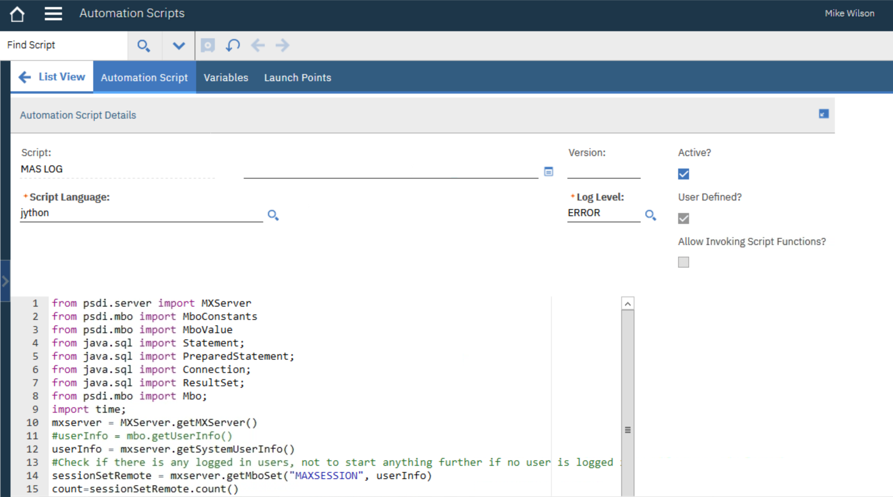
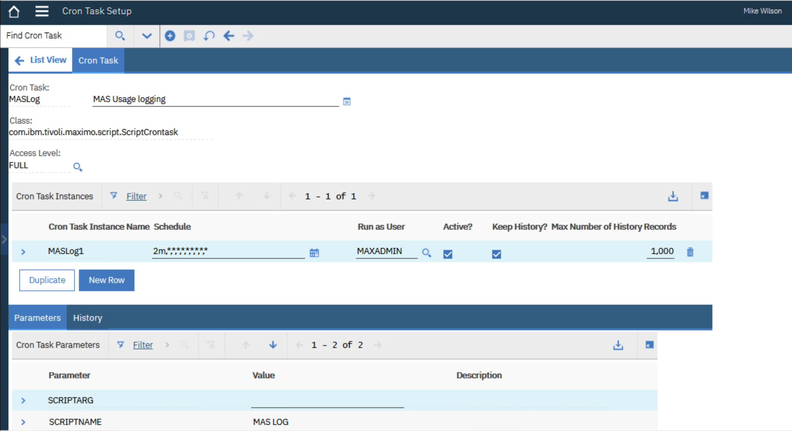
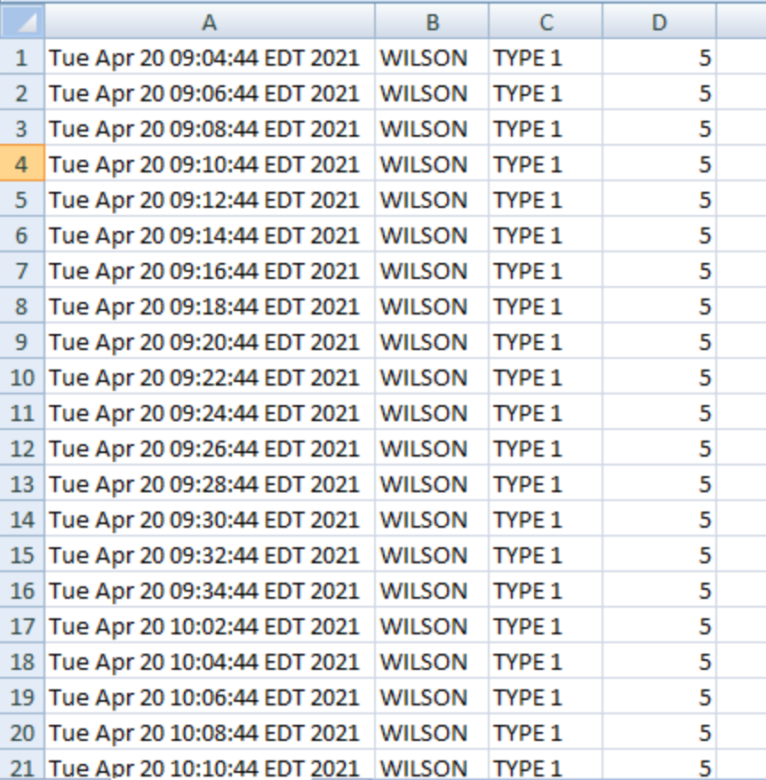

# License Monitoring tool for evaluation of concurrent users for aiding  Maximo Application Suite tradeup decisions
## Authored by Tamas Kubicsek with guidance from Hubert Duda, IBM - 2021.04.20

This solution is intended to be used for anyone with an existing IBM Maximo who is planning to evaluate how many Maximo Application Suite points would be needed at a potential MAS Tradeup.

The tool will place a log into a csv (Excel openable) file every 2 minutes about the logged distinct in users, and also if your environment holds in the Maximo users application
the type field filled in with the license you use, it will also give you the points used at each of these 2 minutes. With that in your spreadsheet you can check what was the 
maximum points used, and which time, or you can further analize your usage.

The tool is not impacting your production environment's performance, it is a small footprint code.

# Description of implementation:
## Create an Automation Script with Action launch point
Script name could be: **_MASLog_**. Use **jython** as the script language. No variables are needed. Enter the code below:
```
from psdi.server import MXServer
from psdi.mbo import MboConstants
from psdi.mbo import MboValue
from java.sql import Statement;
from java.sql import PreparedStatement;
from java.sql import Connection;
from java.sql import ResultSet;
from psdi.mbo import Mbo;
import time;
mxserver = MXServer.getMXServer()
#userInfo = mbo.getUserInfo()
userInfo = mxserver.getSystemUserInfo()
#Check if there is any logged in users, not to start anything further if no user is logged in
sessionSetRemote = mxserver.getMboSet("MAXSESSION", userInfo)
count=sessionSetRemote.count()
if count !=0:
    timestamp = mxserver.getDate()
    currentSet = mxserver.getMboSet("MAXUSER",userInfo)
    currentMbo = currentSet.getMbo(0)
    con = currentMbo.getMboServer().getDBConnection(userInfo.getConnectionKey())
    sessionQuery = ['select distinct(userid) "userid" from maxsession where active = 1']
    sessionQuery =''.join(sessionQuery)
    s = con.createStatement()
    rs1 = s.executeQuery(sessionQuery)
    my_file = open('c:\\temp\\MASusageLog.csv','a')
    while(rs1.next()):
	    userid=rs1.getString('userid')
	    userSetRemote = mxserver.getMboSet("MAXUSER",userInfo)
	    userSetRemote.setWhere("USERID ='"+ userid + "'")
	    user = userSetRemote.getMbo(0)
	    usertype = user.getString("TYPE")
	    apppoint=0
	    #Rule engine below to also put nr of points per user. Edit this and add your user types
	    if usertype =="TYPE 1": apppoint=5
	    elif usertype =="TYPE 2": apppoint=10
	    elif usertype =="TYPE 3": apppoint=10
	    my_file.write(str(timestamp) + ','+ userid + ','+ usertype + ','+ str(apppoint)+ '\n')
    my_file.flush()
    my_file.close()
    rs1.close()
```    
It would look like this one: (please note I used for script name: 'MAS Log' with a space between. Name your script and use that name later in the cron task setup.)


You can edit the below part of the script if you have in the Users application the Type field filled in, and than you can use that logic to exactly match the points usage.
```
#Rule engine below to also put nr of points per user. Edit this and add your user types
	    if usertype =="TYPE 1": apppoint=5
	    elif usertype =="TYPE 2": apppoint=10
	    elif usertype =="TYPE 3": apppoint=10
```
## Create Cron task
Create the crontask with name for example: MASLog. Class has to be: **_com.ibm.tivoli.maximo.script.ScriptCrontask_**
Create a cron instance with every 2 minute run, maxadmin as the runasuser.
Enter the parameter called 'Script name' value MASLog, if you named your Script earlier as MASLog.
In the Actions use Reload request to start using the cron.
It should look the following.


## Result CSV file
It is best to copy the output csv before you open it to not harm the cron task to open the file.
You could in the spreadsheet group by timestamps the results as a sum of apppoints per each timestamp, and than to take the maximum of that.



